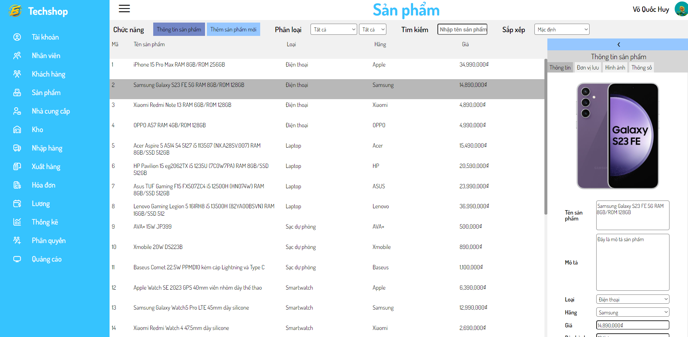

# E-commerce Web App
## Overview
A full E-commerce web application created using PHP for backend processing and HTML, CSS, Javascript for frontend displaying, with features from customer web page to manager web page

## Features
### Customer features
- Customer account creation and authorization.
- Browse for products and view details of a product.
- Purchase and checkout.
- Leave a review and feedback on purchased products.
- Customer account management
### Manager features
- Manage staff infos and accounts.
- Manage customer infos and accounts.
- Manage products infos from product such as prices, images, product details and specifications.
- View and manage product stocks.
- Import and exports product from stocks.
- Manage customer checkouts and invoices.
- Manage staffs wages.
- Manage staff roles and permissions.
## Installation
- Clone or download the project repository
- Install XAMPP and run Apache and MySQL Instance
- Import SQL Database for the project
- Add project files to htdocs in XAMPP
- Connect to the webpage

## Previews
## Customer User Interfaces
### Sign In Page

### Home Page

### Product Catalog Page

### Product Detail Page
#### Product detail information and images

#### Product rating and feedbacks

### Checkout Page

## Manager User Interfaces
### Staff Management

### Customer Management

### Product Management

### Stocks

### Imports and Exports

